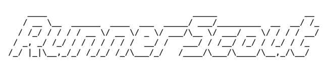

<p align="center">
  <picture>
    <source media="(prefers-color-scheme: dark)" srcset="docs/assets/logo-dark.svg">
    
  </picture>
</p>

<p align="center">
  <em>ephemeral GitHub Actions runners on real cloud spot capacity</em>
</p>

<p align="center">
  <a href="https://github.com/tsouza/runnerscout/actions/workflows/ci.yml"></a>
  <a href="https://github.com/tsouza/runnerscout/releases/latest"></a>
  <a href="go.mod"></a>
  <a href="LICENSE"></a>
</p>

---

A Kubernetes controller for ephemeral GitHub Actions runners on standalone cloud
VMs. RunnerScout searches AWS, Azure and GCP spot capacity using portable resource
requirements and ordinary `runs-on` targeting. It can run alongside
[Actions Runner Controller](https://github.com/actions/actions-runner-controller)
with separate scale-set ownership.

**Pre-1.0; APIs remain experimental.** Real GitHub-to-VM execution, interruption
and cleanup have each been independently qualified against live AWS, Azure and
GCP spot capacity - see [qualification-real-cloud.md](docs/qualification-real-cloud.md)
for what that qualification covers and how to re-run it. The controller supports
mounted configuration or a named RunnerScaleSet CRD. The Helm chart supports both
modes; see the [complete CRD example](examples/multicloud/README.md).

- Hard resource, region and price limits remain enforced during placement.
- On-demand fallback is opt-in and requires definitive spot exhaustion.
- Durable allocation identities preserve recovery and cleanup across restarts.
- GitHub retains job-result authority when local provisioning times out.

## Get started

Use the [Helm chart](charts/runnerscout/README.md) for development installation,
and [operations guide](docs/operations.md) for configuration and recovery.
See [architecture](docs/architecture.md) for placement and lifecycle contracts.

To build locally, install the Go version in `go.mod` and Python 3:

```sh
make verify
make build
```

`make emulators` runs isolated AWS/Azure API checks on a Linux Docker host.
Emulators do not execute real cloud VMs or establish live-provider support.

## Contribute

Read [contributing](CONTRIBUTING.md), [CI](docs/ci.md),
[security](SECURITY.md) and [release requirements](docs/releases.md).

## License

RunnerScout is [MIT licensed](LICENSE).
